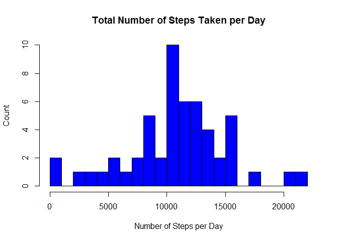
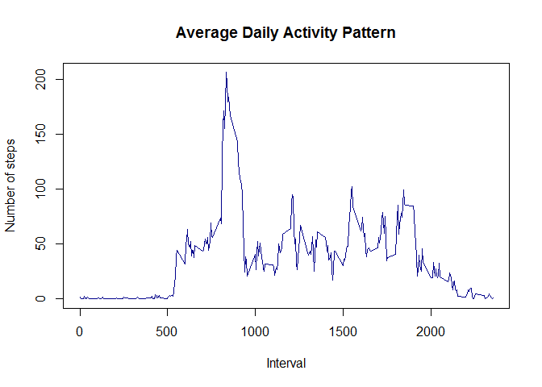
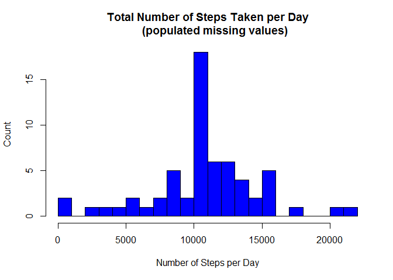
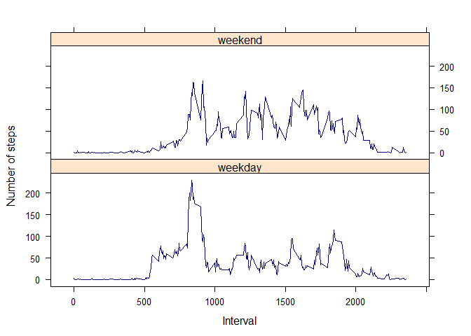

# Reproducible Research: Peer Assessment 1
by **Vasilis Daroglou**  
github repo with RMarkdown source code:  
https://github.com/VDaroglou/RepData_PeerAssessment1  
  
 
## Prepare the Environment
**<u>First of all, you NEED make sure to SET the WORKING DIRECTORY to your**
**LOCAL REPO FOLDER.</u>**  
Throughout this report you can always find the code that I used to generate
my output presents here. When writing code chunks in the R markdown document,
always use **echo = TRUE** so that someone else will be able to read the code.
This assignment will be evaluated via peer assessment so **it’s essential that**
**my peer evaluators be able to review my code and my analysis together.**  
I also change the locale to English in order to ensure the same output for 
peers with other system languages.

```r
library(knitr)
```

```
## Warning: package 'knitr' was built under R version 3.1.3
```

```r
opts_chunk$set(echo = TRUE)
Sys.setlocale("LC_TIME","English")
```
   
## Loading and preprocessing the data
1.  The data is read as a data variable type data frame.  
2.  **steps** column is converted to numeric type.(missing values are coded as NA)  
3.  **date** column is converted to Date type.  
4.  **interval** column is converted to numeric type.  

```r
unzip("activity.zip")
activity <- read.csv("activity.csv",
                     header=TRUE,
                     na.strings="NA",
                     colClasses=c("numeric", "Date", "numeric"))
```
Now, we can proceed with the data pre-examination of its str.

```r
str(activity)
```

```
## 'data.frame':	17568 obs. of  3 variables:
##  $ steps   : num  NA NA NA NA NA NA NA NA NA NA ...
##  $ date    : Date, format: "2012-10-01" "2012-10-01" ...
##  $ interval: num  0 5 10 15 20 25 30 35 40 45 ...
```
   
## What is mean total number of steps taken per day?
For this part of the assignment, we can ignore the missing values in the 
data set.

We initiate with a pre-calculation of steps aggregation by day:

```r
steps_taken_per_day <- aggregate(steps ~ date, activity, sum)
colnames(steps_taken_per_day) <- c("date", "steps")
```
  
The following histogram displays the total number of steps taken per day, 
ignoring missing values.

```r
hist(steps_taken_per_day$steps,
     breaks = 20,
     col = "blue",
     main = "Total Number of Steps Taken per Day",
     xlab = "Number of Steps per Day",
     ylab = "Count")
```

 
  
Finally, we calculate and report the mean and median of the total number 
of steps taken per day:  

```r
mean_steps = mean(steps_taken_per_day$steps, na.rm=TRUE)
median_steps = median(steps_taken_per_day$steps, na.rm=TRUE)
```

The **mean** is **10766.19** and 
the **median** is **10765.**
  
## What is the average daily activity pattern?
First, we calculate the aggregation of steps by intervals of 5-minutes 
and give names for columns of the result of this aggregation.

```r
steps_per_interval <- aggregate(steps ~ interval, activity, mean)
colnames(steps_per_interval) <- c("interval", "steps")
```
  
Then, we present below a plot with the time series of the average number
of steps taken (averaged across all days) versus the 5-minute intervals:

```r
plot(steps_per_interval, type = "l", 
     col = "dark blue",
     main = "Average Daily Activity Pattern",
     xlab = "Interval",
     ylab = "Number of steps")
```

 
  
Then, we calculate the 5-minute interval with the maximum number of steps,
on average across all the days in the dataset:

```r
steps_per_interval$interval[which.max(steps_per_interval$steps)]
```

```
## [1] 835
```
Therefore, the 5-minute interval between **08:35** and **08:40** has the
**maximum number of steps**, on average across all days.
  
## Imputing missing values  
#### Total number of missing values in the dataset
First we calculate and report the total number of missing values in the dataset
(i.e. the total number of rows with NAs)

```r
na_count = sum(is.na(activity))
na_count
```

```
## [1] 2304
```
So there are **2304 missing values** in our dataset.  
  
  
#### Strategy for filling in all of the missing values in the dataset
In this part of the assignment, we devise a strategy for filling in 
all of the missing values in the dataset. The strategy is not
sophisticated.  
We choose to use the mean for the 5-minute interval
as fillers for missing values.  
  
  
#### Creation of new dataset with the missing data filled in
So we start creating a new dataseta that is equal to the original dataset
but with the missing data filled in with the mean for the 5-minute interval.

```r
imputed_activity <- merge(activity,
                          steps_per_interval, 
                          by="interval", 
                          suffixes=c("",".interval.mean"))
nas <- is.na(imputed_activity$steps)
imputed_activity$steps[nas] <- imputed_activity$steps.interval.mean[nas]
imputed_activity <- imputed_activity[,1:3]
```
This is the str of the new dataset.

```r
str(imputed_activity)
```

```
## 'data.frame':	17568 obs. of  3 variables:
##  $ interval: num  0 0 0 0 0 0 0 0 0 0 ...
##  $ steps   : num  1.72 0 0 0 0 ...
##  $ date    : Date, format: "2012-10-01" "2012-11-23" ...
```
And the count of its missing values. We should get a "0".

```r
sum(is.na(imputed_activity))
```

```
## [1] 0
```
  
  
#### Histogram of the total number of steps taken each day.(missing data filled in)
We initiate with a pre-calculation of steps aggregation by day:

```r
full_steps_taken_per_day <- aggregate(steps ~ date, imputed_activity, sum)
colnames(full_steps_taken_per_day) <- c("date", "steps")
```
  
The following histogram displays the total number of steps taken per day, 
ignoring missing values.

```r
hist(full_steps_taken_per_day$steps,
     breaks = 20,
     col = "blue",
     main = "Total Number of Steps Taken per Day
     (populated missing values)",
     xlab = "Number of Steps per Day",
     ylab = "Count")
```

 

#### Calculate and report the mean and median total number of steps taken per day  
Then, we calculate and report the mean and median of the total number 
of steps taken per day:

```r
mean_full_steps = mean(full_steps_taken_per_day$steps)
median_full_steps = median(full_steps_taken_per_day$steps)
```

The **mean** is **10766.19** and 
the **median** is **10766.19**.  
  
  
#### What is the impact of imputing missing data on the estimates of the total daily number of steps?
So now we wil compare these values with the values from the estimates
from the first part of the assignment. 

- The **mean** before populating missing values is **10766.19**.  
- The **mean** after populating missing values is **10766.19**.
  
- The **median** before populating missing values is **10765**.  
- The **median** after populating missing values is **10766.19**.  

So we can observe, that while the mean value remains unchanged, 
the median value has shifted and matches the mean.  
It seems that the impact of imputing missing values has increase our median,
but has not affected negatively our predictions.
  
## Are there differences in activity patterns between weekdays and weekends?
For this part of the assignment we are going to Use the dataset with the 
filled-in missing values.  
At first, we will reate a new factor variable in the dataset with two levels 
-- "weekday" and "weekend" indicating whether a given date is a weekday or 
weekend day. We will define the "daytype"" function for this purpose.

```r
daytype <- function(date) {
    if (weekdays(as.Date(date)) %in% c("Saturday", "Sunday")) {
        "weekend"
    } else {
        "weekday"
    }
}
imputed_activity$daytype <- as.factor(sapply(imputed_activity$date, daytype))
```
  
Then, we make a panel plot containing a time series plot (i.e. type = "l") 
of the 5-minute interval (x-axis) and the average number of steps taken, 
averaged across all weekday days or weekend days (y-axis).  
  

```r
daytype_interval_steps <- aggregate(data = imputed_activity,
                                  steps ~ daytype + interval,
                                  FUN = mean)

library(lattice)

xyplot(steps ~ interval | daytype,
       data = daytype_interval_steps,
       xlab = "Interval",
       ylab = "Number of steps",
       col = "dark blue",
       type = "l",
       layout =c(1, 2))
```

 

We can observe from the graph above that activities on the **weekdays** have the 
**greatest peak** from all steps intervals. But, we can also observe that 
**weekends** steps have **more peaks over hundred steps** than weekdays. We can
relate this to the fact that in weekends a person has more free time to do more
intesive activities along the day than in weekdays, probably because of work.
